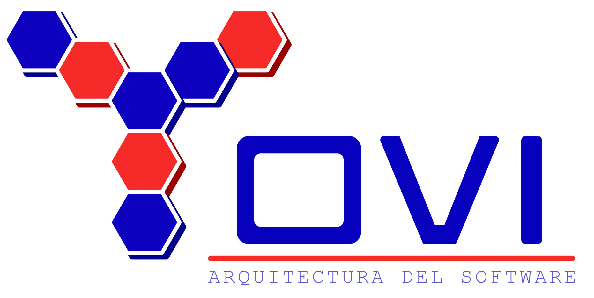
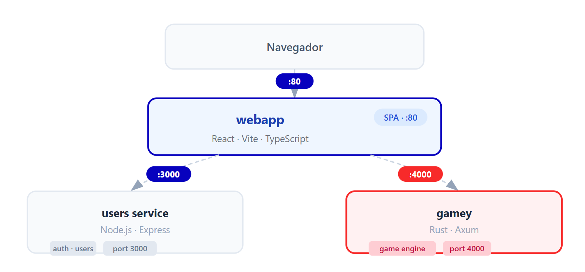

<p align="center">
  
</p>

[](https://github.com/arquisoft/yovi_es2b/actions/workflows/release-deploy.yml)
[](https://sonarcloud.io/summary/new_code?id=Arquisoft_yovi_es2b)
[](https://sonarcloud.io/summary/new_code?id=Arquisoft_yovi_es2b)
[](https://sonarcloud.io/summary/new_code?id=Arquisoft_yovi_es2b)
[](https://sonarcloud.io/summary/new_code?id=Arquisoft_yovi_es2b)
[](https://sonarcloud.io/summary/new_code?id=Arquisoft_yovi_es2b)

> Implementación multi-servicio del juego Y desarrollada para la asignatura de Arquitectura del Software en la Universidad de Oviedo.

---

## Enlaces

| | |
|---|---|
| 🌐 **Aplicación** | [gameyes2b.duckdns.org](https://gameyes2b.duckdns.org/) |
| 📖 **Documentación** | [arquisoft.github.io/yovi_es2b](https://arquisoft.github.io/yovi_es2b/) |

---

## Equipo

|  |  |  |
|:---:|:---:|:---:|
| [Sara Naredo](https://github.com/saranaredo) | [Jimena Vázquez](https://github.com/JimenaVazquez) | [Iyán Iglesias](https://github.com/iyaniglesias) |
| Frontend | UO301668 | UO302334 |

---

## Tabla de contenidos

- [Visión general de la arquitectura](#visión-general-de-la-arquitectura)
- [Estructura del proyecto](#estructura-del-proyecto)
- [Prerrequisitos](#prerrequisitos)
- [Variables de entorno](#variables-de-entorno)
- [Ejecutar el proyecto](#ejecutar-el-proyecto)
  - [Con Docker](#con-docker-recomendado)
  - [Sin Docker](#sin-docker)
- [Scripts disponibles](#scripts-disponibles)
- [Tests](#tests)
- [Documentación](#documentación)
- [Resolución de problemas](#resolución-de-problemas)

---

## Visión general de la arquitectura

El sistema se compone de tres servicios independientes que se comunican por HTTP:

<p align="center">
  
</p>

| Servicio | Tecnología       | Puerto | Responsabilidad                         |
|----------|-----------------|--------|-----------------------------------------|
| webapp   | React/Vite/TS   | 80     | SPA frontend                            |
| users    | Node.js/Express | 3000   | Registro y autenticación de usuarios    |
| gamey    | Rust/Axum       | 4000   | Motor de juego y servicio de bots       |

La documentación de arquitectura sigue la plantilla [Arc42](docs/).

---

## Estructura del proyecto

```
yovi_es2b/
├── webapp/         # Frontend React + Vite + TypeScript
├── users/          # Servicio de usuarios Node.js + Express
├── gamey/          # Motor de juego y bots en Rust
├── docs/           # Documentación de arquitectura Arc42
└── docker-compose.yml
```

---

## Prerrequisitos

Asegúrate de tener instalado lo siguiente antes de ejecutar el proyecto:

| Herramienta     | Versión  | Necesaria para            |
|-----------------|----------|---------------------------|
| Docker          | 24+      | Ejecución en contenedores |
| Docker Compose  | 2.x      | Ejecución en contenedores |
| Node.js         | 22.x     | Desarrollo local          |
| npm             | 10+      | Desarrollo local          |
| Rust            | stable   | Desarrollo local de gamey |
| Cargo           | stable   | Desarrollo local de gamey |

---

## Variables de entorno

Cada servicio se puede configurar mediante variables de entorno. Ajústalas en un archivo `.env` en la raíz o directamente en `docker-compose.yml`.

### Servicio users

| Variable        | Valor por defecto | Descripción                           |
|-----------------|-------------------|---------------------------------------|
| `PORT`          | `3000`            | Puerto en el que escucha el servicio  |
| `USERS_DB_URL`  | _(ninguno)_       | Cadena de conexión a la base de datos |

### Servicio gamey

| Variable    | Valor por defecto | Descripción                                     |
|-------------|-------------------|-------------------------------------------------|
| `PORT`      | `4000`            | Puerto en el que escucha el servicio            |
| `RUST_LOG`  | `info`            | Nivel de log (`debug`, `info`, `warn`, `error`) |

### webapp

| Variable            | Valor por defecto       | Descripción                     |
|---------------------|-------------------------|---------------------------------|
| `VITE_API_BASE_URL` | `http://localhost:3000` | URL base del servicio users     |
| `VITE_GAMEY_URL`    | `http://localhost:4000` | URL base del servicio gamey     |

---

## Ejecutar el proyecto

### Con Docker

Requiere Docker y Docker Compose.

```bash
# Construir e iniciar todos los servicios
docker-compose up --build

# Ejecutar en segundo plano
docker-compose up --build -d

# Detener todos los servicios
docker-compose down
```

Una vez en marcha, los servicios están disponibles en:

| Servicio        | URL                   |
|-----------------|-----------------------|
| Aplicación web  | http://localhost      |
| API users       | http://localhost:3000 |
| API gamey       | http://localhost:4000 |

---

### Sin Docker

Ejecuta cada servicio en una terminal separada.

#### 1. Servicio users

```bash
cd users
npm install
npm start
# Disponible en http://localhost:3000
```

#### 2. Aplicación web

```bash
cd webapp
npm install
npm run dev
# Disponible en http://localhost:5173
```

O arranca ambos a la vez desde el directorio webapp:

```bash
cd webapp
npm run start:all
```

#### 3. Servicio gamey

```bash
cd gamey
cargo build
cargo run
# Disponible en http://localhost:4000
```

---

## Scripts disponibles

### webapp

| Comando             | Descripción                                 |
|---------------------|---------------------------------------------|
| `npm run dev`       | Inicia el servidor de desarrollo            |
| `npm run build`     | Compila para producción                     |
| `npm test`          | Ejecuta los tests unitarios                 |
| `npm run test:e2e`  | Ejecuta los tests end-to-end con Playwright |
| `npm run start:all` | Inicia webapp y el servicio users a la vez  |

### users

| Comando     | Descripción                    |
|-------------|--------------------------------|
| `npm start` | Inicia el servicio de usuarios |
| `npm test`  | Ejecuta los tests              |

### gamey

| Comando       | Descripción                       |
|---------------|-----------------------------------|
| `cargo build` | Compila la aplicación             |
| `cargo test`  | Ejecuta los tests unitarios       |
| `cargo run`   | Ejecuta la aplicación             |
| `cargo doc`   | Genera la documentación de la API |

---

## Tests

El proyecto utiliza distintas estrategias de testing por servicio:

- **webapp** — Vitest para tests unitarios, Playwright + Cucumber para tests E2E.
- **users** — Jest para tests unitarios e integración.
- **gamey** — Framework de testing nativo de Rust (`cargo test`).

La cobertura de código se monitoriza mediante [SonarCloud](https://sonarcloud.io/summary/new_code?id=Arquisoft_yovi_es2b).

Para ejecutar todos los tests en local:

```bash
# webapp
cd webapp && npm test

# users
cd users && npm test

# gamey
cd gamey && cargo test
```

---

## Documentación

La documentación de arquitectura está escrita en AsciiDoc siguiendo la plantilla [Arc42](https://arc42.org/) y se encuentra en el directorio `docs/`.

Para generarla y visualizarla en local (requiere [Asciidoctor](https://asciidoctor.org/)):

```bash
asciidoctor docs/index.adoc -o docs/output/index.html
```

---

## Resolución de problemas

**Puerto ya en uso**
```bash
# Encuentra y mata el proceso que usa el puerto (ej. 3000)
lsof -i :3000
kill -9 <PID>
```

**Errores de permisos con Docker en Linux**
```bash
sudo usermod -aG docker $USER
# Cierra sesión y vuelve a entrar
```

**Gamey no compila (`cargo build` falla)**

Asegúrate de tener la toolchain de Rust actualizada:
```bash
rustup update stable
```

**La webapp no alcanza el servicio users**

Comprueba que `VITE_API_BASE_URL` apunta a la dirección real del servicio users. Dentro de Docker, los servicios se comunican por nombre de servicio, no por `localhost`.

---